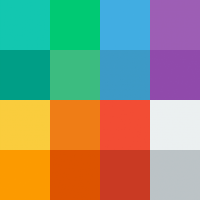

#  BlendApp

Aplikacja stworzona z myślą o ważonym nakładaniu obrazów w formacie .bmp, a tym samy podglądu wyniku działania algorytmu.

## Co umożliwia ?

#### 1) Wybranie liczby wątków

Użytkownik może zadać liczbę wątków, która oznacza na ile części zostaną podzielone obrazy, 

wywołując dla każdej z nich algorytm dodawania obrazów.

Dodatkowo program dostarcza również informacji jaką jest rekomendowana tj. wolna liczba wątków do wykorzystania.


#### 2) Wybranie biblioteki

Możliwe jest wskazanie odpowiedniej biblioteki napisanej w jęzku asemblera lub C#, 
która udostępnia funkcję realizującą **ten sam** algorytm ważonego nakładania obrazów. 

#### 3) Podanie wagi nakładanego obrazu

Wartość ta powinna być z przedziału ***od 0 do 255*** i oznacza ona z jaką "siłą" zostanie nałożony drugi obraz, na obraz bazowy. 

  * 0 - obraz nakładany nie będzie widoczny
    * ...
    * ...
  * 255 - obraz bazowy zostanie całkowicie przysłonięty przez obraz nakładany

#### 5) Wyświetlenie obrazu wynikowego

Klikając przycisk *Połącz* zostaniemy poproszeni o wskazanie miejsca gdzie należy zapisać obraz wynikowy, 
a następnie zostanie on wyświetlony w oknie aplikacji.


## Zależności i ograniczenia

Aktualna wersja aplikacji była pisana i testowana w środowisku 32-bitowy. Jednak uruchomienie jej w systemie 64-bitowy również nie powinno przysporzyć problemów.

 * Ograniczenia
    * Obsługiwanym formatem pliku jest **24-bitowa grafika bitmapowa bez kompresji RLE o DPI równym 96**,
    ograniczenia te nie wynikają z zaimplementowanego algorytmu, tylko z zastosowanej technologi WPF 
    odczytującej bitmapy.

License
-------


```
This program is free software; you can redistribute it and/or
modify it under the terms of the GNU General Public License
as published by the Free Software Foundation; either version 2
of the License, or (at your option) any later version.

This program is distributed in the hope that it will be useful,
but WITHOUT ANY WARRANTY; without even the implied warranty of
MERCHANTABILITY or FITNESS FOR A PARTICULAR PURPOSE.  See the
GNU General Public License for more details.

You should have received a copy of the GNU General Public License
along with this program; if not, write to the Free Software
Foundation, Inc., 59 Temple Place - Suite 330, Boston, MA  02111-1307, USA.
```
Copyright (C) 2015 **Mateusz Szostok**
